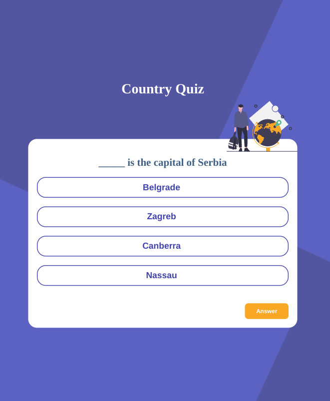
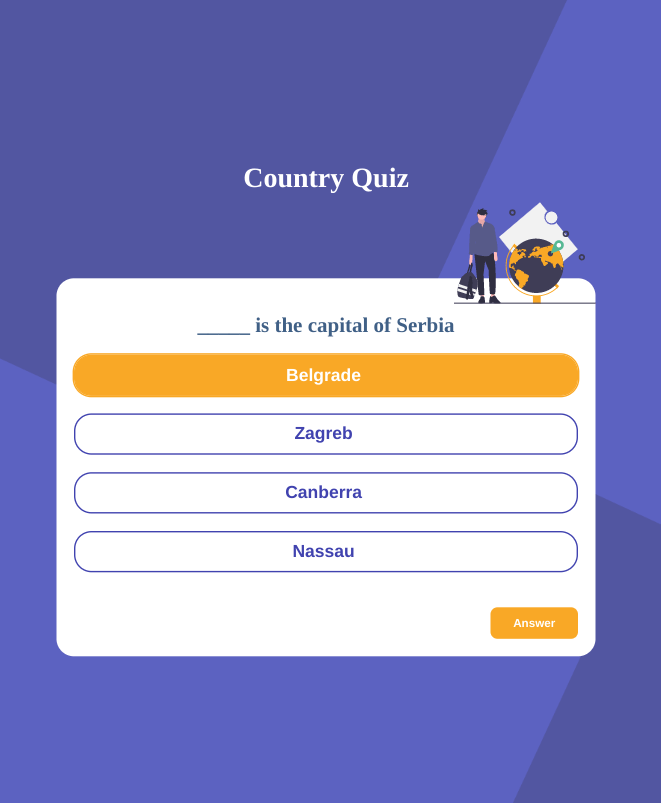
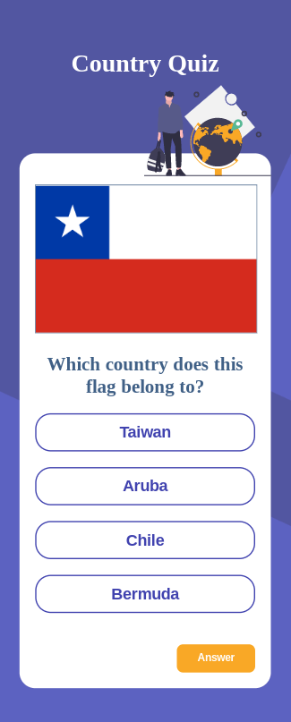
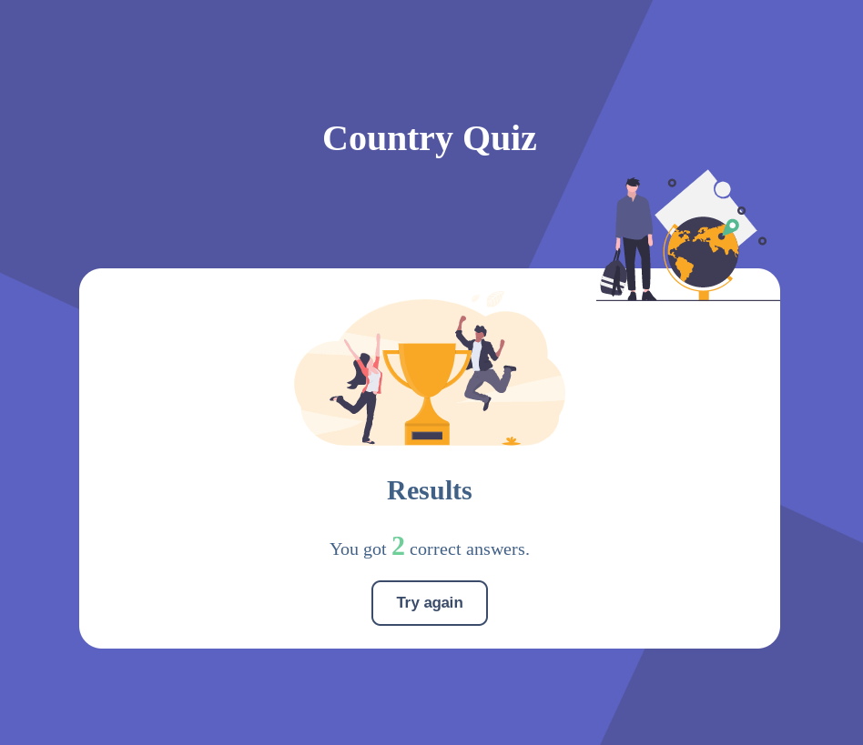

<h1 align="center">Country Quiz</h1>

   Solution for a challenge from  <a href="http://devchallenges.io" target="_blank">Devchallenges.io</a>.

  <h3>
     <a href="https://jdegand.github.io/country-quiz">
      Live Link
    </a>
     | 
    <a href="https://web.archive.org/web/20240417033427/https://legacy.devchallenges.io/challenges/Bu3G2irnaXmfwQ8sZkw8">
      Challenge
    </a>
  </h3>

## Table of Contents

- [Overview](#overview)
  - [Built With](#built-with)
- [Features](#features)
- [Requirements](#requirements)
- [Thoughts](#thoughts)
- [Useful Resources](#useful-resources)

## Overview

***

***

***

***

### Built With

- [React](https://reactjs.org/)
- [React Query](https://react-query.tanstack.com/)
- [Rest Countries API](https://restcountries.com/)

## Features

This application/site was created as a submission to a [DevChallenges](https://devchallenges.io/challenges) challenge. The [challenge](https://web.archive.org/web/20240417033427/https://legacy.devchallenges.io/challenges/Bu3G2irnaXmfwQ8sZkw8) was to build an application to complete the given user stories. **Note**: The previous design document may be incomplete, as you need to find an archived version of the challenge as all `legacy` challenges have had their documentation removed from DevChallenges.

## Requirements

- [x] You can see at least 2 types of questions: a city is the capital of.. or a flag belong to country..
- [x] You can select an answer
- [ ] You can see if answer is correct or incorrect
- [x] When you answer correctly, you move on to the next question
- [x] When you answer incorrectly, you see your results
- [x] You can try again

## Thoughts

- Implementation choice: grab all data once vs grabbing data after each correct submission.
- Since the game should end after a wrong answer, it may be best to refetch data after each correct answer.  
- Are users going to play long enough to require more data than the initial download size?
- How many questions do you have to get correct in a row to surpass the initial download size?
- How long would users typically use such an app?
- You can waste users' bandwidth.
- Grabbing all the countries is ~ 146kb.
- Selecting all countries of a region is ~ 30kb.
- You can drastically cut that by filtering with fields (name,capital,flags).
- Selecting one country is ~ 1.5kb.
- 368ms for 4 parallel queries by name without filtering.
- Times can really vary, but with filtering each query should be 40-70ms at best and 100ms+ at worst.
- Since you need 4 answers, is it best to do a parallel query?
- Could use an answer array and function to get a random value to complete the query.  
- Could make an array of all 250 countries and then grab 4 random values and then complete 4 queries with those values.
- The API does have some weird inconsistencies and creates edge cases you need to account for.
- Querying a name on the API can be problematic for countries with names longer than one word.  May need to encode the space with `%20` and verify how the API named such countries.
- Some countries may return an array for a field when most countries would have only a string - if country had a territory - etc.
- So I just removed certain problematic countries from the countries array.  
- The fact that React Query documentation is minimal (*on purpose*) really made this more difficult to choose implementation details.
- useQueries may not be an ideal solution here.  The amount of queries is not going to change, but I think it makes sense to batch code versus having 4 separate queries where you have to alias all returned properties.  [Stack Overflow](https://stackoverflow.com/questions/66427968/how-to-handle-multiple-queries-with-react-query) mentioned this dilemma and the unclear implementation details in the docs.  
- The poor documentation is why I went through a YouTube course on React Query.  
- Seems like React Query makes more network requests than you would think.  It is definitely over-eager in fetching data and I think that could be why passing variables to React Query can cause issues, i.e. infinite loops.
- The DevChallenges requirements bake in poor performance.  Client-side rendering.  You need multiple API calls for one question or a large api call.  You possibly need a global state object for scoring.
- React 18 shows double all console logs in strict mode. I had trouble checking an useQueries error because the console logs were flooded.
- React 18 evaluates components twice.
- `useId` is not for adding keys to a list items inside `render`.  I made that mistake in the Capital and Flag components. `useId` is implemented with refs.  See [React Docs](https://reactjs.org/docs/hooks-reference.html#useid) for more.  `useId` is really not useful, and I don't see `useId` being used extensively.  
- There are problems when the flag image doesn't show up.  User scores are lost on refresh. A user will just have to guess if there is no flag.
- To keep answer hidden, useQuery(`https://restcountries.com/v3.1/name/{answer}?fields=capital`) then evaluate the returned capital name to your answer
- Extra request may not be necessary?
- I thought about not showing result screen if score was 0 and you got first question wrong -> just reload the page.  
- I didn't consult the project requirements enough doing this - my primary goal was using React Query and getting it working.
- Design implies no start screen - ie load question on first load - but has end result page.  With React Query, it would make more sense if there was a start and end screen - so you can set `enabled: false`. Otherwise, you might have to duplicate logic or send a parameter to flip the value of enabled.  
- Testing React Query is an involved process with limited information.  This application might be easier to test since I used custom hooks.  I have not seen how to test React Query without a custom hook wrapper.

## Useful Resources

- [Steps to replicate a design with only HTML and CSS](https://devchallenges-blogs.web.app/how-to-replicate-design/)
- [Stack Overflow](https://stackoverflow.com/questions/4550505/getting-a-random-value-from-a-javascript-array) - random value from array
- [CSS Tricks](https://css-tricks.com/snippets/javascript/array-of-country-names/) - array of country names
- [Stack Overflow](https://stackoverflow.com/questions/17546953/cant-access-object-property-even-though-it-shows-up-in-a-console-log) - can't access property in object
- [Stack Overflow](https://stackoverflow.com/questions/66427968/how-to-handle-multiple-queries-with-react-query) - multiple queries in react-query
- [Stack Overflow](https://stackoverflow.com/questions/71522324/react-can-and-will-sometimes-call-your-components-multiple-times) - Strict Mode now shows double console.logs
- [Stack Overflow](https://stackoverflow.com/questions/5836833/create-an-array-with-random-values) - create array with random values
- [Stack Overflow](https://stackoverflow.com/questions/53779182/how-to-append-value-to-an-array-only-if-not-exists-and-remove-it-if-not) - add unique values to array
- [Github](https://github.com/tannerlinsley/react-query/discussions/3227) - useQueries and config object
- [Stack Overflow](https://stackoverflow.com/questions/70602394/react-usequery-hook-with-useeffect-hook) - usequery with useeffect
- [MDN Docs](https://developer.mozilla.org/en-US/docs/Web/HTML/Global_attributes/tabindex) - tabindex
- [YouTube](https://www.youtube.com/watch?v=ZfvOHRX-FDM) - test react query components
- [Blog](https://tkdodo.eu/blog/testing-react-query) - testing react query
